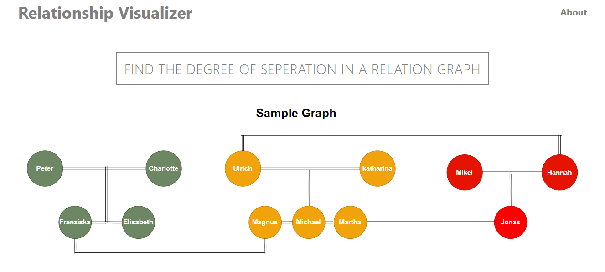
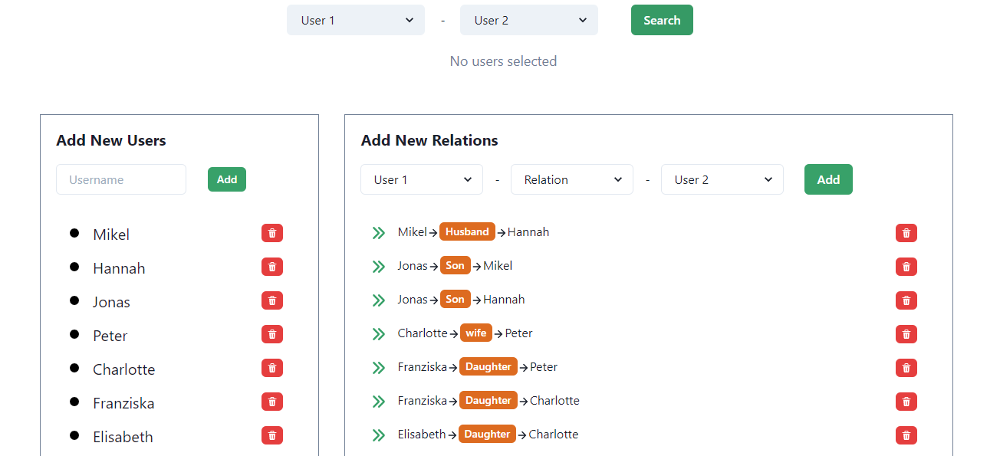
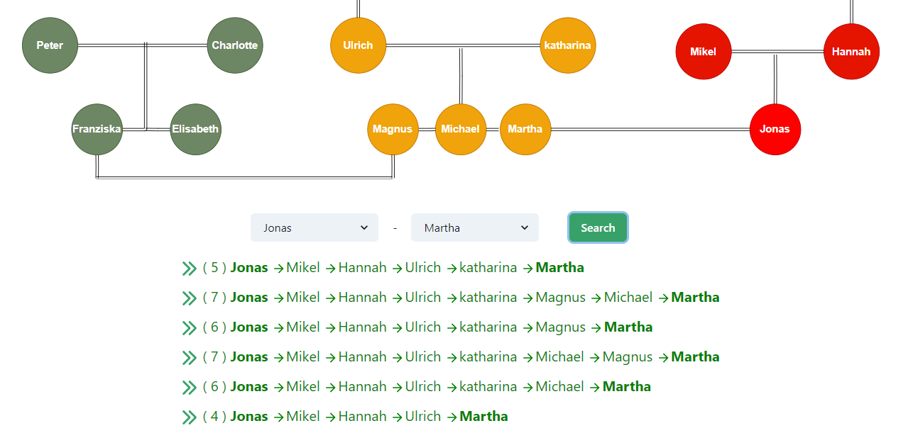

# Relationship Visualizer App | UI

<p float="center" align="middle">
  
</p>

<p float="center" align="middle">
  
</p>

<p float="center" align="middle">
  
</p>

<p float="center" align="middle">
  
</p>

## Project Description | [Live Demo](https://relationshipvisualizer.netlify.app/) 
- The App uses Depth First Search (DFS) to traverse the Users graph, and find the path between the 2 selected nodes. Each node is a User which contains all the user data like User ID, Name, Relation Type between the users etc. The top 5 paths along with the Degree of Seperation is displayed on the UI.
- The App is developed using the MERN stack, and uses Heroku to deploy the server and Netlify fo the application UI.

## Run Locally

- Clone the repo in your machine.

```
// UI
mkdir client
cd client
git clone https://github.com/100sarthak100/RelationshipVisualizerUI
npm install

// Server
mkdir server
cd server
git clone https://github.com/100sarthak100/RelationshipVisualizer
npm install
```

- Make a `.env` file in the server directory and copy your MongodB connection URI there along with the port number.

- Change the baseUrl in the client/src/api/index.js file to the local url.

- Then run the application
```
// client
npm start

// server
npm start
```

- The server and the clinet can be accesed from here
```
Client -> http://localhost:3000/
Server -> http://localhost:5000/
```

## Scope for Improvement
### DFS | Time Complexity O(V + E)
- The Application uses DFS graph traversal algorithm to traverse the User graph and return all the paths between 2 users.
- The time complexity of DFS is O(V + E) where V is the number of users and E is the number of relation between them.
- As the number of users and the relations increases the algorithm will take more time to return the result.
- We can build a Graph Database on AWS Using Amazon DynamoDB and Titan, to scale our application for >=1M users. [Amazon AWS](https://aws.amazon.com/blogs/big-data/building-a-graph-database-on-aws-using-amazon-dynamodb-and-titan/) 
- The application can later be optimized for mobile devices also.